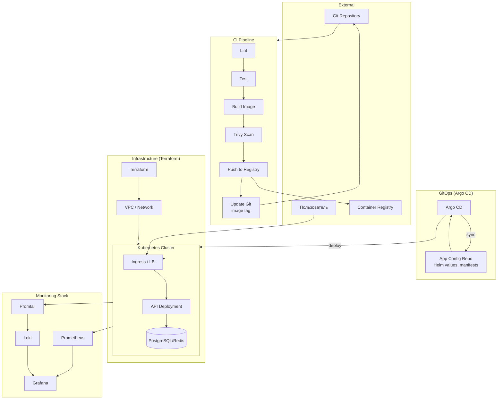

# Final Project — Архитектурная диаграмма

## Общая схема (Mermaid)

---

## Поток данных

1. **Разработка**: коммит в Git → CI (lint, test, build, Trivy, push) → обновление образа в Git (values/chart).
2. **Деплой**: Argo CD синхронизирует кластер с Git → приложение обновляется.
3. **Трафик**: User → Ingress → API → DB.
4. **Мониторинг**: Prometheus scrape метрик, Promtail собирает логи → Grafana.

---

## Компоненты по слоям

| Слой | Компоненты |
|------|------------|
| **Infra** | Terraform, VPC, K8s cluster |
| **App** | API (Deployment), DB (StatefulSet/managed) |
| **Networking** | Ingress, Service |
| **CI/CD** | GitHub Actions / GitLab CI, Argo CD |
| **Monitoring** | Prometheus, Grafana, Loki, Promtail, Alertmanager |
| **Security** | Trivy, SealedSecrets/SOPS, securityContext |
